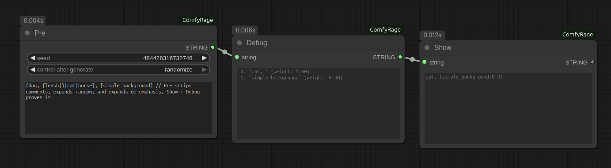

# ComfyRage

## Example



```
{dog, {leash|}|cat|rabbit|horse|fox|bird}, [simple_background] // Pre strips comments, expands random, and expands de-emphasis, Show + Debug proves it!
```

## Install

Clone into `ComfyUI/custom_nodes`.

## Nodes

### ⚙️Pre

ComfyUI only expands random prompt syntax when the text is written directly into a CLIP text input. When the prompt is refactored to prevent duplication or routed through subgraphs, the random syntax is **not expanded**.

The **Pre** node expands it once so the final text can be reliably viewed, reused, and passed consistently to downstream nodes.

You can combine **Pre** with **Show** or **Debug** to inspect the output, or pass the expanded text directly to an encoder.

**Features:**

- **Strip comments:** /* // */: `/* comment1 */ tag1, tag2, // comment2`
- **Expand random:** {|}: `{tag1|tag2|tag3, {tag4|}}`
- **Expand de-emphasis:** []: `[more[less]]`

---

### ⚙️Show

ComfyUI provides **Preview Any** to display text as it flows through a workflow, but it doesn't persist, so eventually it becomes impossible to inspect.

The **Show** node lets you **inspect the text at any point**, without modifying it, which is useful for debugging or verifying prompts.

**Features:**

- Display text persistently in the node for inspection.
- Optionally pass input as output.

---

### ⚙️Debug

ComfyUI does not provide a way to visualize weights, such as de-emphasis or nested weighting.

The **Debug** node lets you **inspect prompt weights** helping you understand how the final prompt will be interpreted by the encoder.

**Features:**

- Display weights persistently in the node for inspection.
- Optionally pass input as output.
