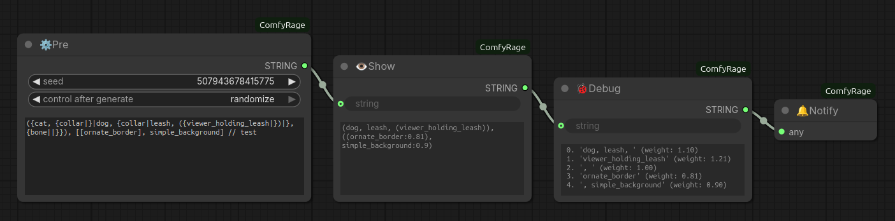

# 🎲 ComfyRage

## Example



```text
({cat, {collar|}|dog, {collar|leash, ({viewer_holding_leash|})|}, {bone||}}), [[ornate_border], simple_background] // test
```

## Install

Either:

- Search ComfyUI Manager for `ComfyRage` and Install.

Or:

- Clone into `ComfyUI/custom_nodes`.

## Nodes

### ⚙️Pre

ComfyUI expands random prompt syntax **only when the text is written directly into a CLIP text input**. When the prompt is refactored to prevent duplication or routed through sub-graphs, the random syntax is **not expanded**.

The **Pre** node expands it once so the final text can be reliably viewed and forwarded.

**Features:**

- Expand random, strip comments, handle emphasis.

  - `{tag1|tag2|tag3, {tag4|}}`
  - `/* comment1 */ tag1, tag2, // comment2`
  - `(more[less])`

---

### 👁️Show

ComfyUI provides **Preview Any** to display text as it flows through a workflow, but it doesn't persist, so eventually it becomes empty.

The **Show** node lets you **inspect the text at any point**, without modifying it, which is useful for debugging or verifying prompts.

**Features:**

- Display and persist text, optionally forward.

---

### 🐞Debug

ComfyUI does not provide a way to visualize weights, such as de-emphasis or nested weighting.

The **Debug** node lets you **inspect prompt weights** helping you understand how the final prompt will be interpreted by the encoder.

**Features:**

- Display and persist weights, optionally forward.

---

### 🔔Alert

ComfyUI does not provide a way to alert the user when a run is complete.

The **Alert** node lets you **be alerted** with browser notification and sound.

**Features:**

- Send alert with sound.
